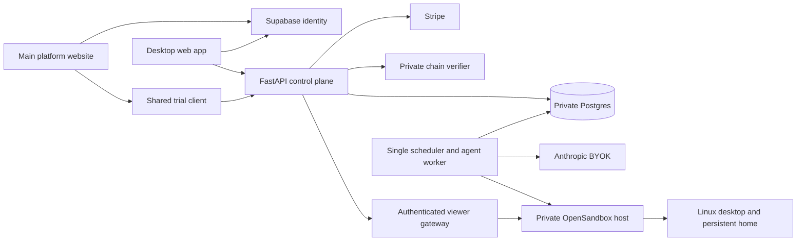

# Architecture

## Runtime

The API records desired state; the worker provisions computers and executes durable runs independently of browser tabs. A Postgres advisory lock restricts lifecycle/metering to one scheduler. Per-run leases and heartbeats coordinate asynchronous model/tool work. A lost worker interrupts uncertain actions rather than replaying them. The pending model tool turn is retained and completed with explicit interruption results on continuation.

The browser sees a continuous VNC stream, not a screenshot slideshow. The agent uses screenshots when visual reasoning is needed, and can also use terminal commands or Playwright connected to the same visible Chromium instance. Human takeover waits until the current tool completes. A separate server-side view-only VNC endpoint prevents observer clients from sending input.

Viewer tickets expire after 60 seconds. Connections recheck membership and controller state. The public browser never receives OpenSandbox credentials. The configured public origin must match the browser origin. The reverse proxy must support WebSockets and must not log viewer-ticket query strings.

Home directories and Chromium profiles persist across stop/start. Processes and RAM do not. Named volumes remain on the host; deleting a computer stops it and uses a short-lived cleanup sandbox to erase its home. Empty Docker volumes can be reclaimed by an operator. This is not a secure physical-media erasure guarantee.

## Identity and credits

Supabase signs browser sessions; the backend verifies asymmetric JWTs and checks workspace membership on every resource. Database tables are private to the backend. Run the initial schema command with a private table-owner database role. Never distribute that role to browsers. Owner-only changes include provider keys, billing, invitations and computer deletion.

Provider keys use Fernet encryption. Preserve the encryption key separately from database backups. Minutes are charged through unique ledger keys, with workspace row locks. Paid credits are valid during the paid period; unused top-ups carry while subscribed. Trials expire after 168 hours and have a separate configurable credit allowance. A Stripe webhook cannot restore canceled access with an old invoice because subscription status is retrieved before credit grants.

## Approval boundary

The agent has an explicit approval tool, and its run pauses until a user approves or declines the described action. The model is instructed to ask before messages, purchases, publishing and consequential changes. **This is model-mediated behavior, not a deterministic security barrier:** general browser and shell access can perform external actions. Public launch needs adversarial computer-use testing and a decision on stronger destination/credential restrictions.

## Initial capacity

Four globally running computers; one running per workspace, two saved on the paid plan, one saved on trial; 2 CPU and 4 GiB RAM per desktop. Idle computers stop after 15 minutes. Runs are capped at 60 minutes/200 steps. Hard storage quotas, encrypted backup/restore automation and cancellation retention are still deployment blockers, documented separately.
